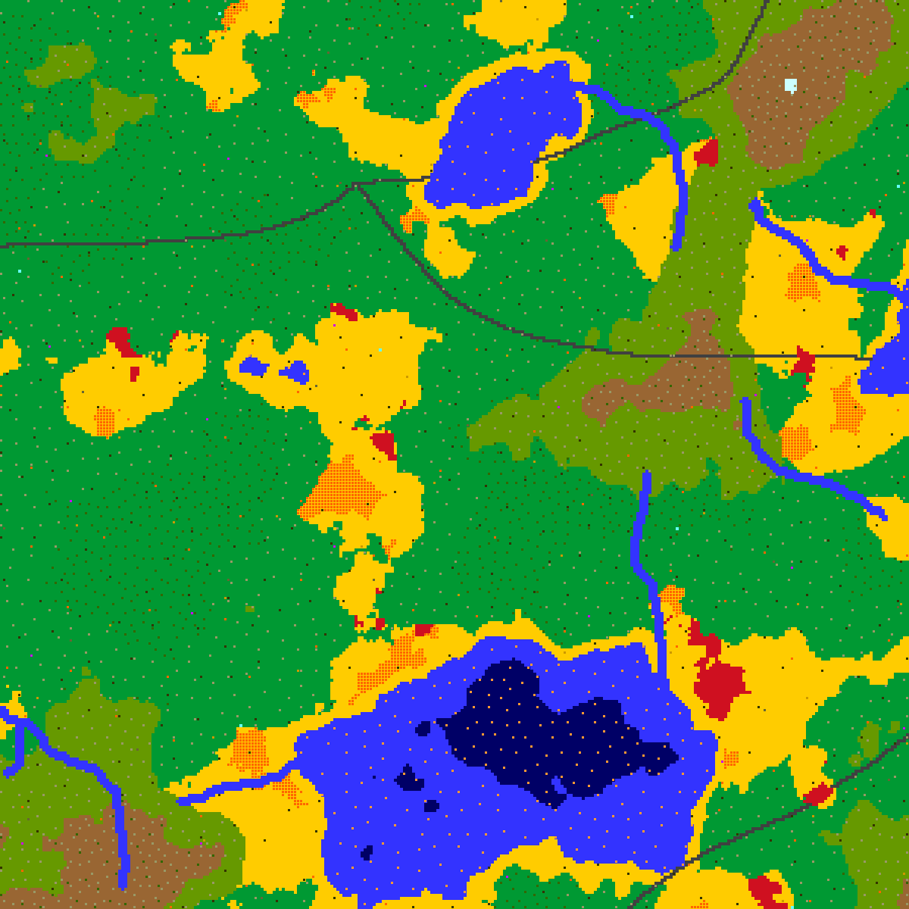
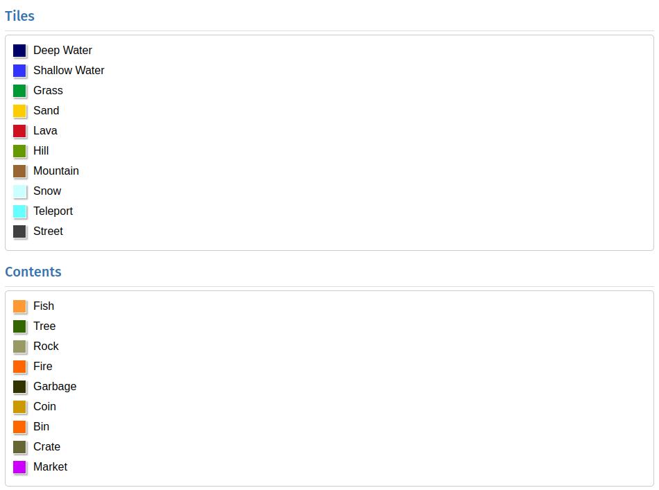

# Midgard

Midgard is a World Generation tool wich implements the `Generator trait` defined by `Robotic-Lib`

#### *Midgard is a magical world rich in treasures and dangers. Will your AI be able to navigate and conquer the magic lands of our world generator?*



# Legend



### Features:
- Seed based generation.
    - All random elements of the world generation follow the provided seed and are independent of one another,
      meaning the world is 100% reproducible and tweaks to one part of the generation process won't influence 
      another.
- Configurability.
    - The `WorldGeneratorParameters` struct provides a convenient way to tweak the behaviour of the various
      stages of world generation without having to specify parameters irrelevant to your use case.
- Fully documented, documentation visible with rustdoc.
- Elevation generation.
    - The world is generated starting from an elevation map which defines the shape of the terrain.
- Biomes generation.
    - Biomes are generated based on altitude and temperature.
    - Biomes list:
        - DeepWater
        - ShallowWater
        - Beach
        - Desert
          - In deserts you can fine lava lakes and fire patches.
        - Plain
        - Forest
        - Hill
        - Mountain
        - SnowyMountain
- Rivers generation
    - Rivers generation is based on altitude. Rivers spawn in the mountains and follow the altitude to end in a lake or the sea.
- Streets generation.
    - Streets spawn in the world connecting random points. This gives the robot a street infrastructure to use and start from.
- Teleports generation.
    - Teleports spawn in random locations.
- Content generation
    - Each content has a different spawn probability and for some contents the probability also changes based on the biome.
      These probabilities can be configured by the user.
    - Contents:
        - `Tree` spawns in `Forest`, `Hill` and `Mountain`. Fewer trees spawn as the elevation increase
        - `Rock` spawns in `Plain`, `Hill`, `Mountain` and `SnowyMountain`. More rocks spawn as the elevation increase.
        - `Fish` spawns in `ShallowWater` and `DeepWater`. More fish spawn as the water depth increase.
    - `Garbage`, `Coins`, `Bins`, `Crates`, `Markets` spawn randomly in the world with different probabilities
- Weather forecast generation
    - The weather forecast is generated choosing a random weather for each day.
    - Weather types: `Sunny`, `Foggy`, `Rainy`, `TrentinoSnow`, `TropicalMonsoon`
    - `always_sunny` is a parameter that allow to generate an always sunny weather.
- Spawn point generation
    - The spawn point is guaranteed to be in a valid environment.
    - To make the start easier the robot will only spawn in these biomes, in order of preference: Plains, Beach, Forest


# Example

```rust
use robotics_lib::world::world_generator::Generator;
use midgard::world_generator::WorldGenerator;
use midgard::world_generator::WorldGeneratorParameters;
use midgard::world_visualizer::WorldVisualizer;

fn main() {
    // Define the WorldGenerator parameters using the dedicated struct
    let params = WorldGeneratorParameters {
        seed: 15, // fixed seed
        world_size: 200, // smaller world
        amount_of_rivers: None, // disable rivers
        amount_of_streets: Some(1.2), // more streets
        ..Default::default() // the rest of the parameters keep their default value
    };

    // Instantiate the WorldGenerator with the parameters
    let mut world_generator = WorldGenerator::new(params);
    // Generate the world
    let (world, _spawn_point, _weather, _max_score, _score_table) = world_generator.gen();

    // Use 'WorldVisualizer::visualize' to render the world at the specified resolution
    WorldVisualizer::visualize(world, 600);
}
```

# Configuration Parameters

- `seed: u64`
  - Seed used for world generation.
- `world_size: usize`
  - length of the side of the world, which is always a square
- `always_sunny: bool`
  - if true disables weather generation and the weather will always be sunny
- `weather_forecast_length: u64`
  - the number of days of weather that should be generated
- `time_progression_minutes: u8`
  - the amount of minutes that pass for each tick
- `starting_hour: u8`
  - the starting hour, for example if starting hour == 8 after generation the time will be 8:00 AM
- `world_scale: f64`
  - the scaling of the world. a smaller scale will result in smaller mountains, valleys and lakes, 
   and shorter distances between them
- `amount_of_rivers: Option<f64>`
  - Controls the amount of rivers generated. If set to None the river generation step will be skipped.
- `amount_of_streets: Option<f64>`
  - Controls the amount of streets generated. If set to None the street generation step will be skipped.
- `amount_of_teleports: Option<f64>`
  - Controls the amount of teleports generated. If set to None the teleport generation step will be skipped.
- `elevation_multiplier: Option<f64>`
  - Controls the maximum elevation, and scales all elevation accordingly.
- `contents_radii: ContentsRadii`
  - Controls the amount of each tile content to be spawned. See ContentsRadii
- `score_table: Option<HashMap<Content, f32>>`
  - Sets a custom score table. If set to None the default one provided by robotics_lib will be used.
- `max_score: f32`
  - sets the maximum score the robot can earn
